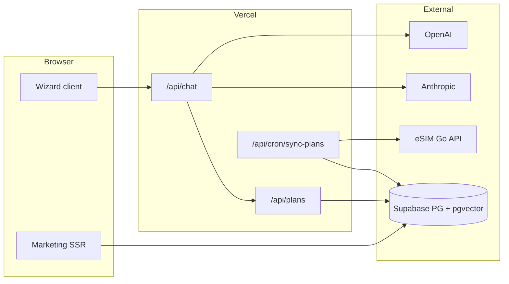

# eSIMSeeker — project context for Cursor

Canonical product and implementation context for this repository. Generated from the **eSIMSeeker — Brand Guidelines & Cursor Deployment Plan** PDF; keep code and UI aligned with these sections.

---

## Brand colours (Tailwind — use PDF hex values)

Register and use these keys in `tailwind.config.ts` (do not swap for alternate brand-sheet hexes unless the team explicitly standardizes):

| Token | Hex | Usage |
|-------|-----|--------|
| `brand-red` | `#C0392B` | Terracotta / primary CTAs, accents |
| `brand-navy` | `#0A192F` | Dark surfaces, headers, depth |
| `brand-teal` | `#20B2AA` | Secondary accent, links/highlights |
| `brand-paper` | `#F8F9FA` | Light backgrounds, cards on marketing |

Map **Shadcn CSS variables** so components default to navy/paper surfaces and terracotta CTAs. Use existing Shadcn text tokens for dark UI contrast where the PDF specifies.

**UI defaults (Shadcn):** `rounded-lg`, `shadow-sm` as baseline for components unless a variant requires otherwise.

---

## Typography

- **Body / UI:** **Inter** via Google Fonts or `next/font/google`.
- **Headings:** weight **700**, letter-spacing **-0.5px to -1px** (tight).
- **Body:** weight **400**, line-height **1.5–1.6**.
- **Data / code / mono:** **JetBrains Mono** or **Fira Code**.

---

## Logo & assets

- Horizontal logo and app icon live under `public/` (e.g. `logo`, `icon` as SVG or optimized PNG).
- **Minimum width ~120px** for horizontal logo where specified; do not stretch, recolour, or add effects to brand marks.

---

## High-level architecture

**Flow in prose:** Marketing pages are SSR and may read from Supabase. The wizard talks to `/api/chat` (streaming, model routing). Chat may call plan retrieval via `/api/plans` or shared server logic. Cron `sync-plans` pulls from eSIM Go and writes to Supabase. Embeddings and plan search use **pgvector** on Postgres.

---

## App Router structure (route groups)

| Area | Path | Role |
|------|------|------|
| Marketing + pSEO | `app/(marketing)/` | Home, country pages, optional activity/duration URLs |
| Wizard | `app/(app)/wizard/` | AI-assisted plan finder |
| APIs | `app/api/` | `chat`, `plans`, `cron/sync-plans`, etc. |

**pSEO (reference):** `app/(marketing)/esim/[country]/page.tsx` — `generateStaticParams` for top countries (e.g. 50+), `dynamicParams = true`, `revalidate = 86400`. Prefer ordering by `countries.traffic_rank` (or equivalent) when generating static params.

---

## Data & integrations (Supabase + services)

- **Supabase:** Postgres + **pgvector**; tables along the lines of `countries`, `providers`, `plans`, `plan_embeddings`; **RLS** with public read on `plans` and `plan_embeddings` where the spec allows.
- **Libs (intended paths):** `lib/supabase/client.ts`, `lib/supabase/server.ts`, `lib/esim-go.ts`, `lib/affiliate.ts` (`buildAffiliateUrl` + affiliate token map).
- **Cron:** `app/api/cron/sync-plans/route.ts` — protect with `CRON_SECRET`; sync plans from eSIM Go.

**Important implementation note:** Server-side tools (e.g. `getPlans`) must **not** use client-relative `fetch` to `/api/...`. Use a shared server function or an **absolute** base URL from `NEXT_PUBLIC_SITE_URL`.

---

## AI wizard (reference)

- **Prompts / tools:** `lib/ai/system-prompt.ts`, `lib/ai/tools.ts` — e.g. `getPlans` with **Zod** schema (destination, duration, persona, device, voice).
- **APIs:** `app/api/chat/route.ts` (Vercel AI SDK streaming; e.g. GPT-4o-mini for flow, Claude where specified for copy), `app/api/plans/route.ts` (Supabase / embeddings).
- **UI:** `components/wizard/ChatPanel.tsx`, `ResultsPanel.tsx`, `PlanCard.tsx` — split layout, `useChat`, affiliate CTAs via `buildAffiliateUrl`.

---

## Marketing components (reference)

- Home: `app/(marketing)/page.tsx` with pieces like `components/marketing/Hero.tsx`, `CountryGrid.tsx`.
- Cross-brand: `components/marketing/SeatSeekerLink.tsx` (sister brand).

---

## Environment & deploy (Vercel)

Typical variables (names per deployment doc): Supabase keys/URL, `OPENAI_API_KEY`, `ANTHROPIC_API_KEY`, eSIM Go credentials, Impact (or other) affiliate config, `NEXT_PUBLIC_SITE_URL`, `CRON_SECRET`. Add `vercel.json` if cron or runtime needs explicit config.

---

## Auth (later scope)

**Supabase Auth** (magic link + Google): wire after core wizard paths; restrict protected routes only where needed.

---

## Quality targets (post–real data)

- Lighthouse **≥ 95**, LCP **< 1.2s**, TTFB per deployment/performance section of the PDF — validate after assets and catalogue data are live.

---

## Naming & consistency for generated code

- Prefer **TypeScript** throughout; App Router conventions for Next.js **15+**.
- Use **Shadcn/UI** for primitives; align tokens with `brand-*` and mapped CSS variables.
- File and folder names should match the structure above so features stay discoverable.

When in doubt on copy, colour, or route shape, treat this file as the first stop; if it conflicts with a newer product decision, update **this file** and keep `.cursor/rules` pointing here.
